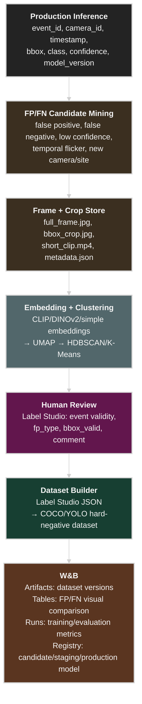
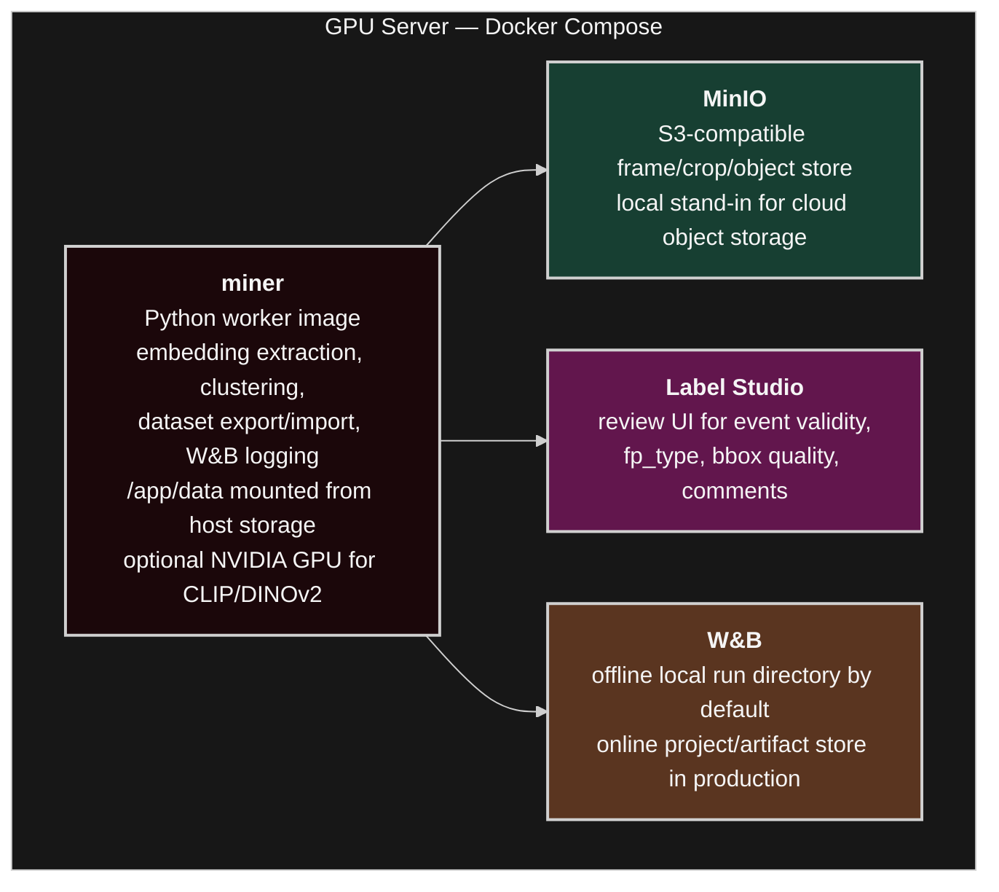

# CV False Positive Mining Lab

A small, practical lab repository for experimenting with a computer-vision false-positive improvement loop:

```text
Production FP events
→ frame/crop collection
→ embedding extraction
→ UMAP/HDBSCAN clustering
→ human review / Label Studio export
→ YOLO/COCO-style dataset build
→ W&B Artifacts + Tables logging
→ retraining/evaluation handoff
```

This repository is intentionally lightweight. It uses a synthetic sample dataset so the pipeline can run without real CCTV footage.

## Why this exists

In production CV systems, false positives are not just failures. They are high-value signals showing where the model confuses real-world edge cases:

- smoke vs steam/fog/dust
- fire vs reflection/headlight/welding/sunset
- falldown vs sitting/crouching/shadow
- intrusion vs animal/tree motion/authorized worker

This lab demonstrates how to group those false positives, review them, and convert repeated patterns into hard-negative datasets.

## Architecture

The full data-centric feedback loop, from production inference to model registry:



### GPU server deployment

The first deployable shape is a single dedicated GPU server running Docker Compose:



This keeps the mining logic stateless: the worker reads config, event metadata, and object paths; writes versioned outputs; and exits. Long-lived state belongs in object storage, Label Studio, W&B, or an external metadata database.

### Active learning loop (extension)

The current lab uses model **pre-annotations** (each task carries the detector's `pred_class`/`pred_confidence`) and **clustering** to select what humans review. It is not yet a closed active-learning loop. The diagram below shows how to close it: add a Label Studio **ML backend** that serves the live detector, rank unlabeled tasks by **uncertainty** (not just cluster membership), and trigger retraining via **webhooks** once a review batch lands.

```mermaid
%%{init: {"theme": "base", "themeVariables": {"background": "#171717", "primaryColor": "#232323", "primaryTextColor": "#f5f5f5", "primaryBorderColor": "#d0d0d0", "lineColor": "#cfcfcf", "fontFamily": "Inter, Arial, sans-serif"}}}%%
flowchart LR
    subgraph LS["Label Studio"]
        tasks["Unlabeled tasks<br/>(candidate FP/FN crops)"]
        review["Human review<br/>event validity, fp_type, bbox"]
    end

    mlb["<b>ML Backend</b><br/>serves current detector<br/>pre-labels + confidence/uncertainty"]
    rank["<b>Acquisition / ranking</b><br/>uncertainty, margin, entropy<br/>+ cluster diversity"]
    builder["<b>Dataset Builder</b><br/>YOLO/COCO hard negatives"]
    train["<b>Training + Eval</b><br/>retrain → regression eval"]
    reg["<b>W&amp;B Registry</b><br/>candidate → staging → production"]

    mlb -->|predictions| tasks
    tasks --> rank --> review
    review -->|webhook: annotation created| builder
    builder --> train --> reg
    reg -->|promote model| mlb

    classDef serving fill:#1b070a,stroke:#d0d0d0,color:#f5f5f5,stroke-width:2px;
    classDef analysis fill:#52676b,stroke:#d0d0d0,color:#f5f5f5,stroke-width:2px;
    classDef review fill:#62164d,stroke:#d0d0d0,color:#f5f5f5,stroke-width:2px;
    classDef dataset fill:#173f32,stroke:#d0d0d0,color:#f5f5f5,stroke-width:2px;
    classDef render fill:#5a3520,stroke:#d0d0d0,color:#f5f5f5,stroke-width:2px;
    class mlb serving;
    class rank analysis;
    class tasks,review review;
    class builder,train dataset;
    class reg render;
    style LS fill:#171717,stroke:#d0d0d0,color:#f5f5f5;
```



Key changes versus today's flow:

- **Selection by uncertainty, not only clusters.** Rank tasks with an acquisition function (least-confidence, margin, entropy) and keep clustering for diversity/dedup, so reviewers see informative *and* representative samples.
- **Live model in the loop.** A Label Studio ML backend serves the current detector for in-UI predictions; promoting a new model in the W&B Registry swaps the backend.
- **Event-driven retraining.** Label Studio `ANNOTATION_CREATED`/project webhooks trigger the dataset builder and a retrain → regression-eval → registry-promotion cycle.

See [`docs/active_learning.md`](docs/active_learning.md) for the full design.

For full design details, GPU/CPU scale-out, and the production hybrid Kubernetes target, see [`docs/architecture.md`](docs/architecture.md) and [`docs/hybrid_k8s_architecture.md`](docs/hybrid_k8s_architecture.md).

## Repository layout

```text
cv-fp-mining-lab/
├── configs/
│   └── pipeline.yaml
├── data/
│   ├── raw/                  # generated sample frames/crops
│   ├── processed/            # embeddings, clusters, datasets
│   └── labelstudio_exports/  # sample Label Studio export JSON
├── docs/
│   ├── active_learning.md
│   ├── architecture.md
│   ├── demo_walkthrough.md
│   ├── fp_taxonomy.md
│   ├── hybrid_k8s_architecture.md
│   └── label_studio_setup.md
├── notebooks/
│   └── 01_fp_clustering.ipynb
├── scripts/
│   ├── 00_generate_sample_data.py
│   ├── 01_extract_embeddings.py
│   ├── 02_cluster_false_positives.py
│   ├── 03_export_for_label_studio.py
│   ├── 04_import_label_studio_export.py
│   ├── 05_log_to_wandb.py
│   └── 06_train_detector.py
├── services/
│   ├── ml_backend.py          # Label Studio ML backend (Phase 2)
│   └── webhook.py             # retrain-trigger receiver (Phase 3)
└── src/cv_fp_lab/
    ├── config.py
    ├── dataset.py
    ├── embeddings.py
    ├── clustering.py
    ├── labelstudio.py
    ├── active_learning.py
    ├── detector.py            # fp_type classifier over embeddings
    ├── registry.py            # local model registry + promotion gate
    ├── training.py            # label assembly + retrain/register
    ├── serving.py             # tasks -> ML-backend predictions
    ├── feedback.py            # webhook parsing + batching
    ├── wandb_logging.py
    └── utils.py
```

## Quick start

For the full local active-learning loop (Label Studio review → webhook retrain →
gate → W&B), follow [`docs/demo_walkthrough.md`](docs/demo_walkthrough.md).

### Docker Compose on a GPU server

For a dedicated mining server, build the worker image and start the local services:

```bash
just docker-build
just docker-up
```

Run the full sample pipeline inside the container:

```bash
just docker-demo
```

Or open a shell in the GPU-enabled mining container:

```bash
just docker-shell
```

The Compose stack includes:

- `miner`: the reusable Python worker image for embedding, clustering, export, import, and W&B logging
- `ml-backend`: Label Studio ML backend serving the detector (Phase 2)
- `webhook`: retrain-trigger receiver (Phase 3)
- `minio`: local S3-compatible object storage for frame/crop artifacts
- `labelstudio`: human review UI
- `wandb`: self-hosted Weights & Biases Server for runs, Tables, and Artifacts

Bring up the local UIs and services with `just docker-up` (minio + labelstudio + wandb)
or `just docker-up-all` (also ml-backend + webhook).

**Host ports.** Defaults follow each service's native port, but on a host where
those are taken you can remap them via a `.env` file (see `.env.example`):
`LABEL_STUDIO_PORT`, `MINIO_API_PORT`, `MINIO_CONSOLE_PORT`, `WANDB_PORT`,
`ML_BACKEND_PORT`, `WEBHOOK_PORT`.

**Self-hosted W&B.** The `wandb` service runs the single-container `wandb/local`
image with a persistent `wandb-server-data` volume. First run: open the W&B UI,
create a user, copy the API key into `.env` as `WANDB_API_KEY`, then set
`WANDB_MODE=online` so `scripts/05_log_to_wandb.py` logs to your instance (clients
reach it at `http://wandb:8080` inside the network). Full W&B Server features
require a license (`WANDB_LICENSE`) from https://deploy.wandb.ai; otherwise W&B
stays in offline mode writing to `./wandb/`.

On an NVIDIA GPU host, install the NVIDIA Container Toolkit and Docker Compose v2. The `miner` service requests all available GPUs through the Compose device reservation block.

### 1. Install dependencies with uv

```bash
uv sync
```

This creates `.venv/` and installs the locked runtime dependencies from `pyproject.toml` and `uv.lock`.

### 2. Generate synthetic false-positive samples

```bash
uv run python scripts/00_generate_sample_data.py
```

This creates small synthetic images representing patterns such as `steam`, `reflection`, `headlight`, `shadow`, and `animal`.

### 3. Extract embeddings

Default mode uses lightweight image features so the demo runs anywhere:

```bash
uv run python scripts/01_extract_embeddings.py --method simple
```

Optional CLIP mode is provided, but requires extra dependencies and model download:

```bash
uv sync --extra clip
uv run python scripts/01_extract_embeddings.py --method clip
```

### 4. Cluster false positives

```bash
uv run python scripts/02_cluster_false_positives.py
```

Outputs:

```text
data/processed/fp_clusters.csv
data/processed/fp_umap.csv
```

### 5. Export tasks for Label Studio

```bash
uv run python scripts/03_export_for_label_studio.py
```

Every task is scored with an uncertainty/acquisition value (active-learning
selection). By default all tasks are exported; pass a review budget to send only
the most informative ones, ranked by uncertainty with round-robin cluster
diversity so a single cluster cannot dominate:

```bash
uv run python scripts/03_export_for_label_studio.py --budget 30 --strategy entropy
# strategies: least_confidence | margin | entropy; add --no-diversity for a plain sort
```

Outputs:

```text
data/processed/labelstudio_tasks.json     # tasks (carry uncertainty + acquisition_rank)
data/processed/labelstudio_ranking.csv    # event_id, cluster_id, confidence, uncertainty, rank
```

This is the "selection" half of the [active learning loop](#active-learning-loop-extension);
the ML backend and webhook-triggered retraining are implemented too — see
[Live model serving and retraining loop](#live-model-serving-and-retraining-loop-phases-23).

### 6. Import reviewed Label Studio export

A small sample export is included:

```bash
uv run python scripts/04_import_label_studio_export.py \
  --input data/labelstudio_exports/sample_review_export.json
```

Output:

```text
data/processed/reviewed_fp_samples.csv
```

### 7. Log dataset and tables to W&B

Offline mode is enabled by default, so this works without a W&B account:

```bash
WANDB_MODE=offline uv run python scripts/05_log_to_wandb.py
```

To use your own W&B project:

```bash
wandb login
WANDB_MODE=online WANDB_PROJECT=cv-fp-mining-lab uv run python scripts/05_log_to_wandb.py
```

### 8. Train the detector and promote it

Train the `fp_type` classifier from current labels (bootstrapped from operator
labels, refined by any review export), evaluate on a hold-out, and gate-promote
it in the local model registry:

```bash
uv run python scripts/06_train_detector.py
```

Outputs a versioned model under `data/processed/model_registry/` with
`candidate → staging → production` aliases. This is the trainable, servable model
behind Phases 2–3.

## Live model serving and retraining loop (Phases 2–3)

The closed [active-learning loop](#active-learning-loop-extension) is implemented
as two small Flask services (optional `serve` extra), backed by the detector and
local registry:

```bash
uv sync --extra serve
```

**Phase 2 — Label Studio ML backend** serves the production detector so the review
UI shows live `fp_type` pre-labels, a confidence score, and an `uncertainty` meta
field for sorting:

```bash
uv run python services/ml_backend.py     # http://localhost:9090
# POST {"tasks": [...]} to /predict ; GET /health
```

Point a Label Studio project's ML backend at this URL.

**Phase 3 — retrain webhook** receives `ANNOTATION_CREATED` events, debounces them
into batches, then retrains → evaluates → gate-promotes a new model version. The
ML backend serves whatever is promoted to `production` next:

```bash
uv run python services/webhook.py        # http://localhost:9091
# Label Studio webhook -> POST /webhook
```

Under Docker Compose both run as services (`ml-backend`, `webhook`). See
[`docs/active_learning.md`](docs/active_learning.md) for the design.

## Label Studio integration concept

This lab does not require a running Label Studio server, but the generated `labelstudio_tasks.json` follows a simple image classification/review task style. In a real deployment:

```text
S3/MinIO frame path
→ Label Studio task
→ human review: is_event, fp_type, bbox_valid
→ export JSON
→ dataset builder
→ W&B Artifact
```

See [`docs/label_studio_setup.md`](docs/label_studio_setup.md).

## W&B usage concept

W&B is used as the lineage and analysis layer:

- **Artifacts**: dataset versions such as `raw-fp-events:v1`, `hard-negative-smoke:v3`
- **Tables**: images, metadata, cluster IDs, human labels, model version
- **Runs**: training/evaluation metrics
- **Registry**: candidate/staging/production model lifecycle

## Suggested next steps

- Replace synthetic samples with real CCTV false-positive frames.
- Add production event metadata from PostgreSQL or Kafka.
- Use CLIP or DINOv2 embeddings instead of simple features.
- Add FiftyOne for visual error analysis.
- Add YOLO/RT-DETR training job and regression evaluation.
- Connect Label Studio webhooks to trigger dataset rebuilds.

## References to study

- Mindtech Global: false positive clustering for object detection data improvement
- ECCV 2018: unsupervised hard example mining from videos
- Label Studio YOLO ML backend
- W&B Artifacts / Tables / Ultralytics integration
- FiftyOne object detection evaluation
