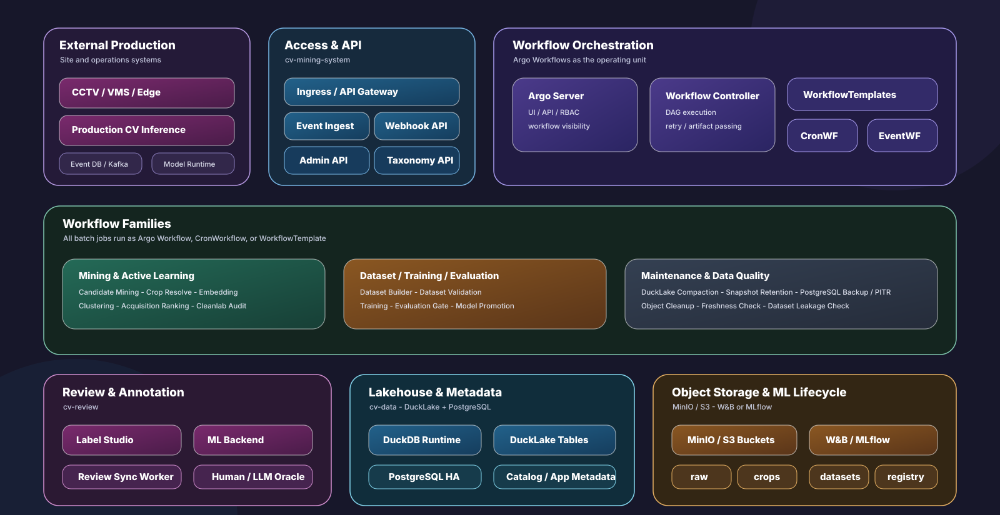

# CV False Positive Mining Lab

A lightweight lab for turning computer-vision false positives into reviewed,
versioned hard-negative datasets and retraining signals.

The repository stays runnable offline by default. The synthetic path needs no
real footage, GPU, Label Studio account, or cloud service. The real-data path
uses D-Fire + YOLO to mine actual detector false positives and feeds them through
the same review, lineage, and gate-promote loop.

```text
production or synthetic FP events
-> frame/crop collection
-> embedding extraction
-> UMAP/HDBSCAN clustering with fallbacks
-> uncertainty + diversity ranking
-> Label Studio review
-> hard-negative dataset build
-> W&B Tables/Artifacts and local registry lineage
-> retraining, evaluation, and promotion gate
```

## What Works Today

- **Synthetic smoke test**: scripts `00` through `06` generate fake FP crops,
  cluster them, export/import Label Studio tasks, log to W&B, and train the local
  sklearn `FpDetector`.
- **Local active-learning loop**: Docker Compose can run Label Studio, a Flask ML
  backend, a retrain webhook, a fileserver, MinIO, and self-hosted W&B.
- **Real-data YOLO track**: scripts `10` through `15` prepare D-Fire, train YOLO,
  mine real false positives, build reviewed hard negatives, retrain, and evaluate
  through a detection-aware promotion gate.
- **Production plan**: the future target is Argo Workflows, object storage,
  DuckLake + PostgreSQL lineage, Label Studio review sync, and W&B/MLflow registry
  controls.

## Quick Start

Install dependencies and run the offline demo:

```bash
just setup
just demo
```

Run checks:

```bash
just check
```

The demo writes generated data under `data/raw/` and `data/processed/`, logs W&B
offline runs under `wandb/`, and creates a local model registry under
`data/processed/model_registry/`.

## Main Commands

```bash
just setup          # uv sync
just check          # ruff + pytest
just demo           # synthetic pipeline, scripts 00 -> 06
just train          # retrain/promote the local FpDetector
just clean          # remove generated data and local W&B outputs

just setup-real     # install YOLO + CLIP extras
just detect-prepare # prepare D-Fire dataset YAML
just detect-train   # train YOLO detector
just mine-fp        # mine real false-positive crops
just build-hardneg  # build reviewed hard-negative YOLO dataset
just retrain-hardneg
just eval-gate      # detection-aware candidate gate

just docker-build
just docker-up      # minio + labelstudio + wandb + fileserver
just docker-up-all  # also ml-backend + webhook
just docker-demo
```

## Local Review Stack

Docker Compose provides the services needed for a local Label Studio + W&B loop:

| Service | Role |
| --- | --- |
| `labelstudio` | human review UI |
| `fileserver` | serves generated task images to the browser |
| `ml-backend` | serves current detector predictions to Label Studio |
| `webhook` | batches annotation events and triggers retraining |
| `wandb` | self-hosted W&B Server for runs, Tables, and Artifacts |
| `minio` | local S3-compatible object store |

Use `.env` from `.env.example` to adjust ports and W&B credentials. The detailed
walkthrough, including Label Studio model/webhook URLs and common fixes, is in
[`docs/current/demo_walkthrough.md`](docs/current/demo_walkthrough.md).

## Real-Data Track

The production-shaped path starts with a real detector instead of synthetic
samples:

```bash
just setup-real
just detect-prepare
just detect-train
just mine-fp
uv run python scripts/01_extract_embeddings.py --method clip
uv run python scripts/02_cluster_false_positives.py
uv run python scripts/03_export_for_label_studio.py --budget 200 --strategy entropy
```

After review, import the Label Studio export and close the loop:

```bash
uv run python scripts/04_import_label_studio_export.py --input <label-studio-export.json>
just build-hardneg
just retrain-hardneg
uv run python scripts/13_evaluate_and_gate.py --candidate /path/to/best.pt
```

See [`docs/current/real_data.md`](docs/current/real_data.md) for dataset paths,
GPU notes, W&B smoke tests, and promotion-gate details.

## Architecture

For the implemented local system, start with
[`docs/current/architecture.md`](docs/current/architecture.md) and
[`docs/current/active_learning.md`](docs/current/active_learning.md).

The future production target keeps the same loop but moves execution and lineage
to Argo Workflows, object storage, DuckLake, PostgreSQL-backed metadata, and
W&B/MLflow registry controls.



Full production design: [`docs/future/`](docs/future/).

## Repository Map

```text
configs/                 pipeline configuration
data/                    generated samples, processed outputs, LS exports
docs/current/            implemented behavior and local runbooks
docs/future/             production roadmap and architecture
docs/reference/          stable taxonomy/reference docs
scripts/00-06_*.py       synthetic/offline mining pipeline
scripts/10-15_*.py       real-data YOLO mining and hard-negative loop
services/                Label Studio ML backend and retrain webhook
src/cv_fp_lab/           reusable library code
tests/                   unit tests for pipeline and service logic
```

## Documentation

- Docs index: [`docs/README.md`](docs/README.md)
- Local demo: [`docs/current/demo_walkthrough.md`](docs/current/demo_walkthrough.md)
- Real-data loop: [`docs/current/real_data.md`](docs/current/real_data.md)
- Label Studio setup: [`docs/current/label_studio_setup.md`](docs/current/label_studio_setup.md)
- FP taxonomy: [`docs/reference/fp_taxonomy.md`](docs/reference/fp_taxonomy.md)
- Production plan: [`docs/future/`](docs/future/)

## Development Notes

- Dependencies are managed with `uv`; optional extras are `clip`, `serve`, and
  `detect`.
- Keep scripts thin and put reusable behavior in `src/cv_fp_lab/`.
- Preserve offline fallbacks: simple embeddings, UMAP/SVD fallback,
  HDBSCAN/KMeans fallback, and empty/single-input handling are intentional.
- Add new tunables to `configs/pipeline.yaml` instead of hardcoding them.
