# Active Learning Loop

## Where the current lab stands

The lab today is **model-assisted curation**, not active learning:

- Tasks carry the detector's prediction as a Label Studio `predictions` block
  (`pred_class`, `pred_confidence`, `model_version`) — see
  `src/cv_fp_lab/labelstudio.py`.
- Sample **selection** is done by UMAP + HDBSCAN/K-Means clustering
  (`src/cv_fp_lab/clustering.py`), which groups repeated FP patterns for bulk review.
- The loop is one-directional: export tasks → human review → `parse_labelstudio_export`
  → reviewed CSV → W&B artifact. Nothing feeds labels back into a live model.

Active learning closes that loop: a live model scores unlabeled candidates, an
acquisition function picks the most informative ones, humans label them, and the new
labels trigger retraining and redeployment.

## Target loop

```mermaid
%%{init: {"theme": "base", "themeVariables": {"background": "#171717", "primaryColor": "#232323", "primaryTextColor": "#f5f5f5", "primaryBorderColor": "#d0d0d0", "lineColor": "#cfcfcf", "fontFamily": "Inter, Arial, sans-serif"}}}%%
flowchart LR
    subgraph LS["Label Studio"]
        tasks["Unlabeled tasks<br/>(candidate FP/FN crops)"]
        review["Human review<br/>event validity, fp_type, bbox"]
    end

    mlb["<b>ML Backend</b><br/>serves current detector<br/>pre-labels + confidence/uncertainty"]
    rank["<b>Acquisition / ranking</b><br/>uncertainty, margin, entropy<br/>+ cluster diversity"]
    builder["<b>Dataset Builder</b><br/>YOLO/COCO hard negatives"]
    train["<b>Training + Eval</b><br/>retrain → regression eval"]
    reg["<b>W&amp;B Registry</b><br/>candidate → staging → production"]

    mlb -->|predictions| tasks
    tasks --> rank --> review
    review -->|webhook: annotation created| builder
    builder --> train --> reg
    reg -->|promote model| mlb

    classDef serving fill:#1b070a,stroke:#d0d0d0,color:#f5f5f5,stroke-width:2px;
    classDef analysis fill:#52676b,stroke:#d0d0d0,color:#f5f5f5,stroke-width:2px;
    classDef review fill:#62164d,stroke:#d0d0d0,color:#f5f5f5,stroke-width:2px;
    classDef dataset fill:#173f32,stroke:#d0d0d0,color:#f5f5f5,stroke-width:2px;
    classDef render fill:#5a3520,stroke:#d0d0d0,color:#f5f5f5,stroke-width:2px;
    class mlb serving;
    class rank analysis;
    class tasks,review review;
    class builder,train dataset;
    class reg render;
    style LS fill:#171717,stroke:#d0d0d0,color:#f5f5f5;
```



## Components to add

### 1. Label Studio ML backend

Run the detector behind the Label Studio ML backend SDK so the UI shows live
predictions and can request scores on demand.

- Implement `predict(tasks, **kwargs)` to return detections + a per-task
  uncertainty score.
- Pin the served model to a W&B Registry alias (e.g. `detector:production`); a
  registry promotion swaps the backend by re-pulling that alias.
- Deploy as its own Compose service / Kubernetes `Deployment` (GPU node pool) so it
  scales independently of the batch miner.

```yaml
# docker-compose.yml (sketch)
ml-backend:
  build: { context: ., dockerfile: Dockerfile.mlbackend }
  environment:
    LABEL_STUDIO_URL: http://labelstudio:8080
    WANDB_MODEL_ALIAS: detector:production
  deploy:
    resources:
      reservations:
        devices: [{ driver: nvidia, count: all, capabilities: [gpu] }]
```

### 2. Acquisition / ranking step

Replace "cluster, then review everything" with "cluster for diversity, then rank within
budget by informativeness". Add a script (e.g. `scripts/06_rank_active_learning.py`) and
a `cv_fp_lab/active_learning.py` module:

- **Uncertainty scores**: least-confidence `1 - max p`, margin `p1 - p2`, or entropy.
- **Diversity**: keep one or a few representatives per HDBSCAN cluster to avoid
  labeling near-duplicates (clustering stays useful — it just feeds ranking).
- **Hybrid score**: `score = α · uncertainty + β · cluster_rarity`, then take the top-N
  within a per-batch review budget.
- Write the ranked subset as the Label Studio task export instead of the full set.

### 3. Webhook-driven retraining

Configure a Label Studio webhook (`ANNOTATION_CREATED` / `ANNOTATIONS_CREATED`, or a
project "annotations submitted" event) to a small receiver that:

1. Debounces until a batch threshold is reached (e.g. N new annotations or a timer).
2. Runs the dataset builder (review export → YOLO/COCO hard-negative dataset).
3. Validates label schema + bbox quality.
4. Launches retraining, then **regression evaluation** against a frozen eval set.
5. Publishes the result as a W&B Artifact and registers a candidate model.
6. Promotes `candidate → staging → production` only if eval gates pass; promotion
   updates the alias the ML backend serves.

In Kubernetes this receiver is a webhook `Deployment` that submits an Argo Workflow /
`Job`; in the Compose lab it can be a tiny FastAPI/Flask service that shells out to the
existing scripts.

## Stopping / iteration policy

- **Budget per round**: fixed reviewer-task budget (e.g. top-200 by acquisition score).
- **Stop when**: regression-eval metric plateaus across rounds, or per-class FP rate
  drops below target, or the acquisition pool is exhausted.
- **Guardrails**: never auto-promote on eval regression; keep a human approval gate on
  `staging → production`.

## Data contracts (additions)

- **Uncertainty record**: `event_id`, `model_version`, `score_type`, `score`,
  `acquisition_rank`, `cluster_id` — persisted alongside the clustering result.
- **Review event**: webhook payload mapped to `event_id` + annotation, idempotent by
  `(event_id, annotation_id)`.
- **Model lineage**: each registered model records training dataset artifact version,
  source query, config hash, and the review-export versions it consumed.

## Minimal first step in this repo — implemented

The *selection* half runs offline today, without standing up any server:

1. `cv_fp_lab/active_learning.py` provides `uncertainty_scores()` (least-confidence /
   margin / entropy, treating `pred_confidence` as `P(positive)`),
   `rank_with_diversity()` (round-robin across clusters; HDBSCAN noise points compete
   as singletons), and `select_for_review()` (attaches `uncertainty` +
   `acquisition_rank`).
2. Synthetic `pred_confidence` is now class-dependent (`CONFIDENCE_BY_FP` in
   `dataset.py`): ambiguous classes (reflection, shadow) sit near the decision
   boundary so uncertainty ranking surfaces them, while steam/fog score confident.
3. `scripts/03_export_for_label_studio.py` accepts `--budget N --strategy {least_confidence,margin,entropy}`
   and `--no-diversity`, writes `labelstudio_ranking.csv`, and embeds `uncertainty` /
   `acquisition_rank` into each Label Studio task so reviewers can sort by
   informativeness. Defaults (no budget) export everything, keeping the demo/CI chain
   intact. Config defaults live under `active_learning:` in `configs/pipeline.yaml`.

Still to do (production extensions): the **ML backend** (§1) and **webhook-driven
retraining** (§3) above. Those require a servable detector, so they come after a
trainable model is added.
