# Active Learning Loop

## Where the current lab stands

The lab now has a small closed-loop active-learning demo and a production-shaped
real-data loop:

- **Synthetic smoke-test loop**: scripts 00-06 create FP samples, rank Label
  Studio tasks by uncertainty + cluster diversity, train the sklearn
  `FpDetector`, serve it through `services/ml_backend.py`, and retrain from
  Label Studio webhook batches through `services/webhook.py`.
- **Primary real-data loop**: scripts 10-15 train/mine with YOLO, cluster/rank
  real FP crops, build reviewed hard-negative datasets, retrain YOLO, and gate
  candidates with detection metrics.

The remaining production gap is not "close the loop" in the repo; it is moving
the loop's durable state into production systems. The acquisition queue, review
outcomes, dataset manifests, and gate results should be synced to DuckLake so
every round can be replayed from a snapshot. See [`../future/`](../future/) for
the full platform contract.

## Target loop

```mermaid
%%{init: {"theme": "base", "themeVariables": {"background": "#171717", "primaryColor": "#232323", "primaryTextColor": "#f5f5f5", "primaryBorderColor": "#d0d0d0", "lineColor": "#cfcfcf", "fontFamily": "Inter, Arial, sans-serif"}}}%%
flowchart LR
    subgraph LS["Label Studio"]
        tasks["Unlabeled tasks<br/>(candidate FP/FN crops)"]
        review["Human review<br/>event validity, fp_type, bbox"]
    end

    mlb["<b>ML Backend</b><br/>serves current detector<br/>pre-labels + confidence/uncertainty"]
    rank["<b>Acquisition / ranking</b><br/>uncertainty, margin, entropy<br/>+ cluster diversity"]
    builder["<b>Dataset Builder</b><br/>YOLO/COCO hard negatives"]
    train["<b>Training + Eval</b><br/>retrain → regression eval"]
    reg["<b>W&amp;B Registry</b><br/>candidate → staging → production"]

    mlb -->|predictions| tasks
    tasks --> rank --> review
    review -->|webhook: annotation created| builder
    builder --> train --> reg
    reg -->|promote model| mlb

    classDef serving fill:#1b070a,stroke:#d0d0d0,color:#f5f5f5,stroke-width:2px;
    classDef analysis fill:#52676b,stroke:#d0d0d0,color:#f5f5f5,stroke-width:2px;
    classDef review fill:#62164d,stroke:#d0d0d0,color:#f5f5f5,stroke-width:2px;
    classDef dataset fill:#173f32,stroke:#d0d0d0,color:#f5f5f5,stroke-width:2px;
    classDef render fill:#5a3520,stroke:#d0d0d0,color:#f5f5f5,stroke-width:2px;
    class mlb serving;
    class rank analysis;
    class tasks,review review;
    class builder,train dataset;
    class reg render;
    style LS fill:#171717,stroke:#d0d0d0,color:#f5f5f5;
```



## Implementation status

The repo now has two intentional tracks:

- **Synthetic smoke-test track** — scripts 00-06, the sklearn `FpDetector`, and the
  Flask ML-backend/webhook demo. This keeps CI and local demos cheap.
- **Primary real-data track** — scripts 10-15, the YOLO `.pt` detector, real FP crop
  mining, Label Studio hard-negative curation, W&B lineage runs, and the
  detection-aware gate.

Implemented pieces:

- **Detector** — `cv_fp_lab/detector.py` (`FpDetector`): a `fp_type` classifier over
  embeddings, with hold-out metrics, confidence, and normalized-entropy uncertainty.
- **Registry** — `cv_fp_lab/registry.py` (`LocalModelRegistry`): filesystem versions +
  `candidate/staging/production` aliases + a metric-gated `maybe_promote`.
- **Phase 1 (selection)** — `cv_fp_lab/active_learning.py` + script 03 flags (see below).
- **Phase 2 (serving)** — `services/ml_backend.py` over `cv_fp_lab/serving.py`.
- **Phase 3 (retraining)** — `services/webhook.py` over `cv_fp_lab/feedback.py` +
  `cv_fp_lab/training.py`.
- **Real-data gate logging** — `scripts/13_evaluate_and_gate.py` logs YOLO
  candidate/production metrics, gate checks, and `.pt` artifacts to W&B
  (`job_type=eval-gate`) while keeping the local registry as the offline source of
  truth.
- **Real-data lineage hooks** — scripts 12, 14, and 15 log `mine-fp`,
  `build-hardneg`, and `yolo-retrain` runs/artifacts to W&B without making W&B a
  hard dependency.

Bootstrap the first model with `scripts/06_train_detector.py`; run the services with
the `serve` extra (`uv sync --extra serve`). The notes below describe the design and
the production hardening still left (W&B-backed registry, GPU serving, dataset
validation, Kubernetes deployment).

## Components

### 1. Label Studio ML backend

Run the detector behind the Label Studio ML backend so the UI shows live
predictions and can request scores on demand.

- Implemented locally by `services/ml_backend.py`, which serves the current
  `LocalModelRegistry` `production` alias and returns Label Studio predictions
  plus a per-task uncertainty score.
- In production, pin the served model to a W&B/MLflow Registry alias; a registry
  promotion swaps the backend by re-pulling that alias.
- Deploy as its own Compose service / Kubernetes `Deployment` so it scales
  independently of the batch miner.

```yaml
# docker-compose.yml (sketch)
ml-backend:
  build: { context: ., dockerfile: Dockerfile.mlbackend }
  environment:
    LABEL_STUDIO_URL: http://labelstudio:8080
    WANDB_MODEL_ALIAS: detector:production
  deploy:
    resources:
      reservations:
        devices: [{ driver: nvidia, count: all, capabilities: [gpu] }]
```

### 2. Acquisition / ranking step

Replace "cluster, then review everything" with "cluster for diversity, then rank
within budget by informativeness". This is implemented in
`cv_fp_lab/active_learning.py` and exposed by `scripts/03_export_for_label_studio.py`:

- **Uncertainty scores**: least-confidence `1 - max p`, margin `p1 - p2`, or entropy.
- **Diversity**: keep one or a few representatives per HDBSCAN cluster to avoid
  labeling near-duplicates (clustering stays useful — it just feeds ranking).
- **Hybrid score**: `score = α · uncertainty + β · cluster_rarity`, then take the top-N
  within a per-batch review budget.
- Write the ranked subset as the Label Studio task export when `--budget` is set.

### 3. Webhook-driven retraining

Configure a Label Studio webhook (`ANNOTATION_CREATED` / `ANNOTATIONS_CREATED`, or a
project "annotations submitted" event) to `services/webhook.py`. The local demo
receiver:

1. Debounces until a batch threshold is reached (e.g. N new annotations or a timer).
2. Persists corrected labels into `data/processed/webhook_reviews.csv`.
3. Retrains the sklearn `FpDetector` from embeddings and label overrides.
4. Evaluates with a hold-out metric and registers a candidate model.
5. Logs a W&B retrain run when W&B is available.
6. Promotes `candidate → staging → production` only if the metric gate passes; promotion
   updates the alias the ML backend serves.

In production this receiver should submit an Argo Workflow / Kubernetes `Job` to
build datasets, validate schemas/bboxes, train, evaluate, and promote out of
process.

## Stopping / iteration policy

- **Budget per round**: fixed reviewer-task budget (e.g. top-200 by acquisition score).
- **Stop when**: regression-eval metric plateaus across rounds, or per-class FP rate
  drops below target, or the acquisition pool is exhausted.
- **Guardrails**: never auto-promote on eval regression; keep a human approval gate on
  `staging → production`.

## Data contracts (additions)

- **Uncertainty record**: `event_id`, `model_version`, `score_type`, `score`,
  `acquisition_rank`, `cluster_id` — persisted alongside the clustering result.
- **Review event**: webhook payload mapped to `event_id` + annotation, idempotent by
  `(event_id, annotation_id)`.
- **Acquisition queue**: `event_id`, `review_batch_id`, `rank_score`,
  `ranking_reason`, `priority`, and status, stored as a queryable production table.
- **Model lineage**: each registered model records training dataset artifact version,
  DuckLake snapshot ID, source query, config hash, and the review-export versions it
  consumed.

## Minimal first step in this repo — implemented

The *selection* half runs offline today, without standing up any server:

1. `cv_fp_lab/active_learning.py` provides `uncertainty_scores()` (least-confidence /
   margin / entropy, treating `pred_confidence` as `P(positive)`),
   `rank_with_diversity()` (round-robin across clusters; HDBSCAN noise points compete
   as singletons), and `select_for_review()` (attaches `uncertainty` +
   `acquisition_rank`).
2. Synthetic `pred_confidence` is now class-dependent (`CONFIDENCE_BY_FP` in
   `dataset.py`): ambiguous classes (reflection, shadow) sit near the decision
   boundary so uncertainty ranking surfaces them, while steam/fog score confident.
3. `scripts/03_export_for_label_studio.py` accepts `--budget N --strategy {least_confidence,margin,entropy}`
   and `--no-diversity`, writes `labelstudio_ranking.csv`, and embeds `uncertainty` /
   `acquisition_rank` into each Label Studio task so reviewers can sort by
   informativeness. Defaults (no budget) export everything, keeping the demo/CI chain
   intact. Config defaults live under `active_learning:` in `configs/pipeline.yaml`.

## Production hardening still left

The offline loop is complete; turning it into production involves swapping the local
pieces for managed ones:

- Replace `LocalModelRegistry` with the W&B Model Registry (Artifacts + aliases).
- Serve the detector on a GPU node pool; embed via CLIP/DINOv2 instead of `simple`.
- Promote the D-Fire/YOLO path to the primary loop: mine real FP crops, review them
  in Label Studio, build hard negatives from the reviewed export, retrain YOLO, and
  compare gate runs in W&B. The synthetic path should remain as CI/demo coverage.
- Have the webhook run the dataset builder + schema/bbox validation before retraining,
  and submit retraining as an Argo Workflow / Kubernetes `Job` rather than in-process.
- Add idempotency by `(event_id, annotation_id)` and a human approval gate on
  `staging → production`.
- Sync active-learning decisions and review outcomes to DuckLake before dataset
  build, then store the resulting snapshot ID in W&B/MLflow artifact metadata.
