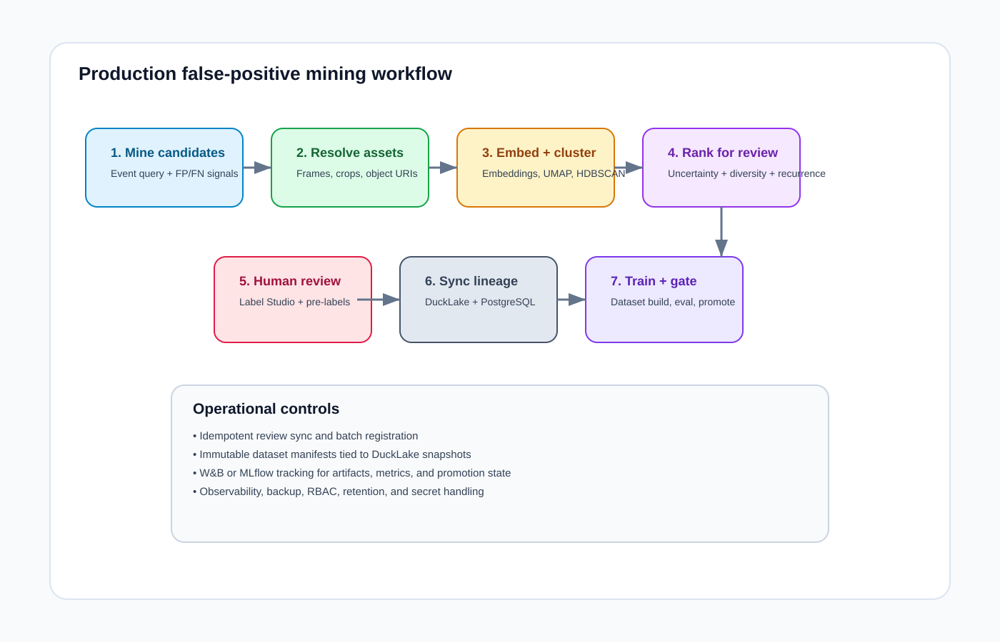
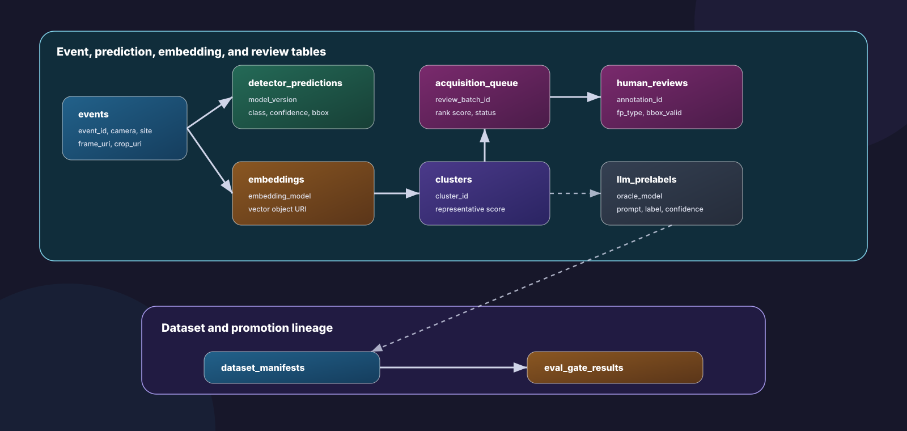
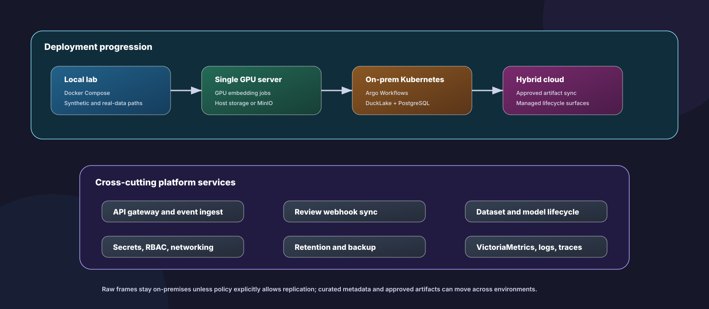

# Production Plan

This is the single future-state document for turning `cv-fp-mining-lab` into a
production computer-vision feedback platform. It is design guidance, not a
requirement for the default local demo or CI path.

The current repo should stay small and runnable offline. Future production work
should add durable contracts around the same core loop: object URIs, Argo
Workflow steps, DuckLake lineage tables, review synchronization, evaluation
gates, and operational controls.

## Current to Future Boundary

| Area | Current repo | Future production target |
| --- | --- | --- |
| Execution | Numbered scripts and Docker Compose | Argo Workflows with CPU/GPU steps |
| Data location | Local files under `data/` | S3/MinIO-style object URIs |
| Metadata | CSV/JSON pipeline outputs | DuckLake tables with PostgreSQL catalog |
| Review | Label Studio import/export | Label Studio + idempotent review sync worker |
| Selection | Uncertainty + cluster diversity | Add recurrence, quality, backlog, site/camera rarity, optional LLM disagreement |
| Dataset lineage | W&B artifacts and local manifests | Dataset manifests bound to DuckLake snapshot IDs |
| Registry | Local registry and W&B logging | W&B/MLflow registry aliases with promotion approvals |
| Deployment | Local or single GPU host | On-prem Kubernetes or hybrid cloud |

## Target Architecture


The platform has these layers:

1. **Production CV systems** emit stable event metadata and object references.
2. **Ingest/API layer** accepts events, review webhooks, taxonomy/config changes,
   and admin operations.
3. **Argo Workflows** runs mining, embedding, clustering, acquisition, review
   sync, dataset build, training, evaluation, promotion, and maintenance jobs.
4. **Object storage** stores frames, crops, embeddings, DuckLake Parquet files,
   datasets, and model artifacts.
5. **Label Studio** provides human review and optional ML-backend predictions.
6. **DuckLake + PostgreSQL** provides queryable row-level lineage and snapshots.
7. **W&B or MLflow** tracks runs, visual reports, artifacts, and model registry
   stages.
8. **Operations/security** covers observability, RBAC, secrets, retention,
   backup, restore tests, and audit logging.

## Production Workflow



```text
production events
  -> candidate mining
  -> frame/crop resolve
  -> embedding shards
  -> UMAP/HDBSCAN or fallback clustering
  -> acquisition ranking
  -> Label Studio review
  -> review sync into DuckLake
  -> dataset manifest build
  -> training
  -> evaluation gate
  -> model registry promotion
```

Recommended workflow families:

| Workflow | Trigger | Output |
| --- | --- | --- |
| Candidate mining | hourly/nightly or event-triggered | candidate event batch |
| Frame/crop resolve | mining batch ready | stable frame/crop URIs |
| Embedding extraction | crop batch ready | embedding objects and metadata |
| Clustering/ranking | embeddings ready | clusters and acquisition queue |
| Review export | acquisition queue ready | Label Studio tasks |
| Review sync | webhook or scheduled export | DuckLake `human_reviews` snapshot |
| Dataset build | reviewed batch accepted | YOLO/COCO data and manifest |
| Training | dataset validation passed | candidate model |
| Evaluation gate | training complete | promotion decision and rollback target |
| Maintenance | scheduled | compaction, retention, backups, freshness checks |

## DuckLake Lineage

DuckLake is the dataset and row-level lineage source of truth. W&B/MLflow remains
the ML lifecycle surface for runs, charts, artifacts, and registry aliases.



Minimum tables:

| Table | Purpose |
| --- | --- |
| `events` | source event metadata, camera/site/time, frame/crop URIs |
| `detector_predictions` | model version, class, confidence, bbox |
| `embeddings` | embedding model/version and vector object URI |
| `clusters` | cluster ID, method/version, representative score |
| `acquisition_queue` | review batch, rank score, reason, priority, status |
| `llm_prelabels` | optional LLM/VLM prediction, prompt version, confidence |
| `human_reviews` | reviewer labels, FP type, bbox validity, comments |
| `dataset_manifests` | dataset version, source query, snapshot ID, split URIs |
| `eval_gate_results` | model version, dataset version, metrics, gate decision |

DuckDB should run inside workflow containers as a stateless runtime. PostgreSQL
backs the DuckLake catalog and application metadata in production.

## Object Storage Contract

Use stable URI-based paths, not host-local paths:

```text
s3://cv-fp-mining/raw/site=<site>/date=<date>/event_id=<event_id>/frame.jpg
s3://cv-fp-mining/crops/site=<site>/date=<date>/event_id=<event_id>/crop.jpg
s3://cv-fp-mining/embeddings/model=<model>/date=<date>/part-000.parquet
s3://cv-fp-mining/ducklake-data/table=<table>/...
s3://cv-fp-mining/datasets/type=hard-negative/class=<class>/version=<version>/manifest.json
s3://cv-fp-mining/ml-artifacts/model=<model>/version=<version>/...
```

Raw frames and crops should stay on-premises unless policy explicitly allows
replication. Curated metadata, aggregate metrics, and approved artifacts can move
to cloud environments when allowed.

## Hybrid Deployment



Use this as the deployment progression:

1. **Local lab**: scripts, Docker Compose, local files, W&B offline/online.
2. **Single GPU server**: same miner image, mounted storage or MinIO, optional GPU
   embeddings.
3. **Shared object storage**: replace local paths with object URIs and signed URLs.
4. **Kubernetes batch**: run scripts as Argo Workflow steps; separate CPU/GPU
   work.
5. **DuckLake lineage**: sync current CSV/JSON outputs into DuckLake tables and
   bind datasets to snapshot IDs.
6. **Production ML lifecycle**: protected eval sets, promotion approvals, registry
   aliases, rollback metadata.
7. **Full platform**: HA PostgreSQL, PITR, NetworkPolicy, RBAC, retention,
   backup/restore tests, observability, and optional cross-site replication.

Recommended namespaces:

```text
cv-mining-system     APIs, controllers, workflow templates, shared config
cv-mining-jobs       Argo pods for mining, embedding, clustering, ranking, datasets
cv-review            Label Studio, Label Studio DB, ML backend, review sync worker
cv-data              MinIO/S3 gateway, PostgreSQL, DuckLake catalog, metadata services
cv-ml-lifecycle      W&B or MLflow, model registry, reports
cv-observability     Prometheus, Grafana, Loki, OpenTelemetry, Alertmanager
cv-security          External Secrets, policy controllers, audit tooling
```

GPU scheduling intent:

```yaml
resources:
  limits:
    nvidia.com/gpu: "1"
nodeSelector:
  workload: cv-mining
  accelerator: nvidia
tolerations:
  - key: nvidia.com/gpu
    operator: Exists
    effect: NoSchedule
```

## Review and Assisted Labeling

Label Studio is the review UI, not the dataset source of truth. The production
source of truth is the validated review sync into DuckLake.

Review sync should merge by:

```text
event_id
annotation_id
review_batch_id
label_version
source
```

Optional LLM/VLM pre-labeling should stay advisory until validated against human
labels. Store those outputs separately from human review:

```text
oracle_type
oracle_model
prompt_version
pre_label
confidence
rationale
created_at
```

Use LLM/VLM output for routing first:

- prioritize detector/LLM disagreement
- prioritize low-confidence or `unknown` outputs
- send high-confidence agreement to faster review
- keep audit sampling before any auto-accept policy

## Active-Learning Ranking

The production acquisition score should be composable:

```text
review_score =
  detector_uncertainty
  + cluster_diversity
  + recurrence_score
  + site_or_camera_rarity
  + detector_llm_disagreement
  + label_quality_risk
  + backlog_priority
```

Clustering remains useful for diversity and deduplication. Novel noise points
should still compete as individual candidates so new failure modes are not
dropped.

## Evaluation and Promotion

Promotion must be multi-criteria. A model should not pass only because it
reduces false positives by detecting nothing.

Gate checks:

- no mAP regression beyond tolerance
- per-class recall floors
- negative-image FP-rate non-increase
- false-negative impact analysis
- site/camera-specific regression checks for critical deployments
- latency/resource checks when serving targets are constrained
- promotion metadata: dataset version, DuckLake snapshot, baseline model,
  candidate model, approval status, promoter, rollback target

## Minimum Production Checklist

- Immutable container image and pinned `uv.lock`.
- Argo WorkflowTemplates for miner, embedding, ranking, review sync, dataset
  build, training, eval gate, and maintenance.
- Separate CPU and GPU node pools.
- Object storage with lifecycle and backup policy.
- External PostgreSQL for Label Studio and DuckLake catalog metadata.
- Idempotent event ingest and review sync.
- Dataset manifests with DuckLake snapshot IDs.
- W&B/MLflow artifact lineage for every curated dataset.
- Evaluation gate workflow with rollback metadata.
- Secrets managed by Vault or cloud secret manager.
- NetworkPolicy for data, review, lifecycle, and job namespaces.
- CI smoke tests and scheduled production canary batch.
- Runbooks for failed workflows, Label Studio recovery, DuckLake sync retries,
  and W&B/MLflow offline sync.

## Near-Term Implementation Order

1. Add an optional DuckLake sync layer over current CSV/JSON outputs.
2. Add dataset manifest fields for DuckLake snapshot ID and source query.
3. Add an Argo-compatible wrapper for the existing numbered scripts.
4. Move review webhook processing to an idempotent review sync job.
5. Add protected evaluation datasets and stricter promotion metadata.
6. Add optional LLM/VLM pre-labeling after human-reviewed validation data exists.
